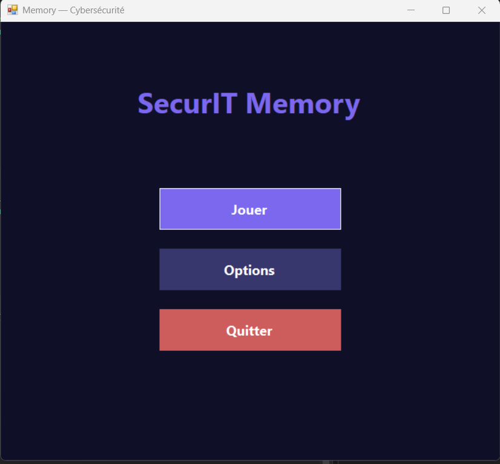
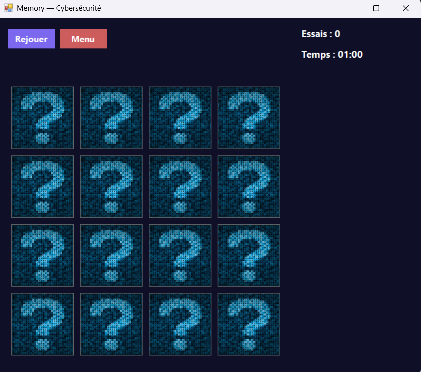
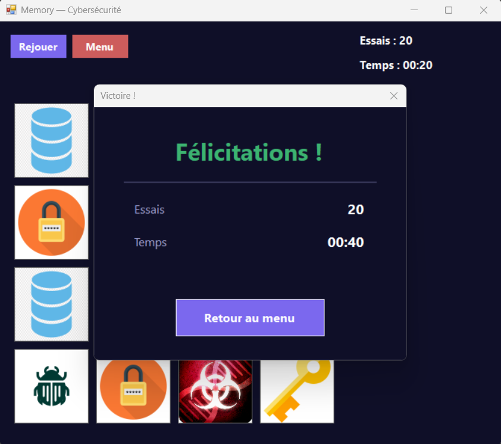

## SecurIT Memory

> Jeu de cartes Memory sur le thème de la cybersécurité — développé en C# / WinForms pour le stand SecurIT au **Salon de l'Innovation Tech**.

---

## Présentation

SecurIT Memory est un mini-jeu interactif mettant en scène des icônes de cybersécurité (virus, cadenas, pare-feu, mots de passe…). Le joueur doit retrouver toutes les paires de cartes en un minimum d'essais et le plus rapidement possible !

---

## Aperçu


| Menu Principal | Grille de Jeu | Victoire |
|:-:|:-:|:-:|
|  |  |  |

---

## Fonctionnalités

### Core
- **Menu principal** avec trois boutons : Jouer, Options, Quitter
- **Grille dynamique** générée en WinForms (taille configurable : 4×4, 6×6)
- **Mélange aléatoire** des cartes à chaque nouvelle partie
- **Retournement de cartes** avec un délai de 1-2 secondes avant de cacher les non-paires
- **Temps impartis** et **compteur d'essais**
- **Détection de victoire** avec affichage du score final victoire ou défaite
- **Boutons rejouer** pour tout reprendre à zéro

### Bonus implémentés 

- **Effets sonores** (retournement, paire trouvée, victoire)


## Architecture du projet

```
memory/
├── Assets/
│   ├── Images/               # dos.png, image_1.png … image_8.png
│   └── Sounds/               # clic.wav, paire.wav, victoire.wav, defaite.wav
├── Properties/               # AssemblyInfo.cs, Resources, Settings
│
├── — Modèle —
├── Carte.cs                  # Données d'une carte (IdPaire, ImageChemin, Etat)
├── EtatCarte.cs              # Enum : Cachee / Revelee / Trouvee
├── Jeu.cs                    # Logique pure : mélange, retournement, vérification paire
├── ConfigPartie.cs           # Paramètres globaux : NombrePaires, NombreColonnes, TempsLimite
│
├── — Vue principale (Form1, découpée en partiels) —
├── Form1.cs                  # Menu panel, transitions menu↔jeu, RetourAuMenu()
├── Form1.Designer.cs         # Boutons Rejouer/Menu, StartPosition CenterScreen
├── Grille.cs                 # Génération grille PictureBox, redimensionnement fenêtre
├── Logique.cs                # Clics cartes, victoire, game over, labels
├── Timers.cs                 # Compte à rebours, délai retournement
│
├── — Fenêtres secondaires —
├── Options.cs                # Choix grille 4×4 / 6×6
├── ResultatForm.cs           # Écran fin de partie (stats + retour menu)
│
├── — Services —
├── Sons.cs                   # Lecture sons WAV (clic, paire, victoire, défaite)
│
├── Program.cs                # Point d'entrée : Application.Run(new Form1())
├── memory.csproj             # Déclaration de tous les fichiers + images en CopyToOutput
└── App.config
```

## ⚙️ Logique de Jeu

```
1. Mélange aléatoire des cartes (Random)
2. Joueur clique sur une carte → Révélée
3. Joueur clique sur une 2e carte → Révélée
4. Comparaison des IDs :
   ✅ Identiques → état Trouvée (paire validée)
   ❌ Différents  → Timer 1-2s → retour état Cachée
5. ⚠️  Pendant le Timer : clics sur les autres cartes bloqués
6. Toutes les paires trouvées → Victoire
```

---

## Installation & Lancement

**Prérequis :** Visual Studio 2022+, .NET Framework 4.8 (ou .NET 6+)

```bash
# Cloner le dépôt
git clone https://github.com/adrynrs/memory.git
cd memory
```

1. Ouvrir `SecurITMemory.sln` dans Visual Studio
2. Build → **Ctrl+Shift+B**
3. Lancer → **F5**

---
